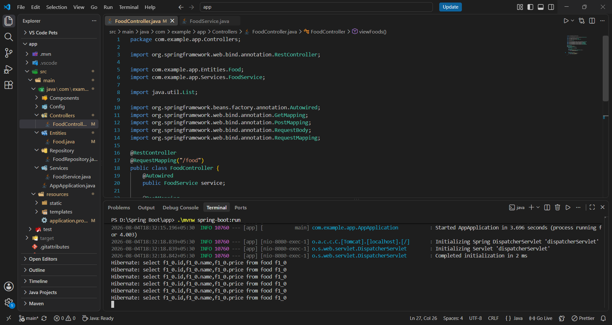
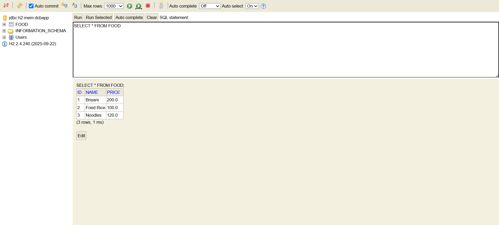
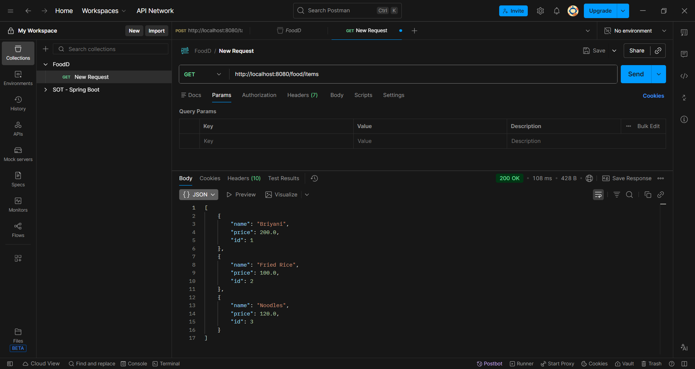

# FoodD Backend

A robust REST API backend for a Food Delivery application built with Spring Boot, featuring a three-layer architecture with comprehensive CRUD operations and database persistence.

**Repository:** [Akilesh-GA/FoodD_Backend](https://github.com/Akilesh-GA/FoodD_Backend)

---

## Overview

FoodD Backend is a production-ready REST API that powers the FoodD food delivery application. It implements a clean three-layer architecture (Controller → Service → Repository) with Spring Data JPA for seamless database operations and H2/MySQL database support.

**Key Features:**
- RESTful API endpoints for food delivery operations
- Three-layer architectural pattern for separation of concerns
- Spring Data JPA integration for efficient database operations
- H2 in-memory and MySQL database support
- Constructor-based dependency injection
- Entity-Repository-Service design pattern
- Comprehensive API documentation

---

## Tech Stack

**Backend Framework**
- Spring Boot 2.x or higher
- Spring Web (REST API development)
- Spring Data JPA (Database abstraction)

**Database**
- H2 Database (Development & Testing)
- MySQL 8.0+ (Production)
- Hibernate ORM (Object-Relational Mapping)

**Build Tool**
- Maven
- Java 11+

**Additional Technologies**
- Tomcat (Embedded Server)
- Jackson (JSON serialization)
- Lombok (Optional - Code generation)

---

## Workflow Screenshots

### Spring Boot


### H2 Database


### Postman


---

## Architecture

### Three-Layer Architecture Pattern

```
┌─────────────────────────────────────────────────┐
│         PRESENTATION LAYER                      │
│  Controllers (@RestController)                  │
│  - Receive HTTP requests                        │
│  - Delegate to services                         │
│  - Return JSON responses                        │
└──────────────────┬──────────────────────────────┘
                   │
                   ▼
┌─────────────────────────────────────────────────┐
│         BUSINESS LOGIC LAYER                    │
│  Services (@Service)                            │
│  - Process business logic                       │
│  - Validation & transformation                  │
│  - Orchestrate repository operations            │
└──────────────────┬──────────────────────────────┘
                   │
                   ▼
┌─────────────────────────────────────────────────┐
│         DATA ACCESS LAYER                       │
│  Repositories (extends JpaRepository)           │
│  - Database CRUD operations                     │
│  - Query abstraction                            │
│  - Transaction management                       │
└──────────────────┬──────────────────────────────┘
                   │
                   ▼
┌─────────────────────────────────────────────────┐
│         PERSISTENCE LAYER                       │
│  Database (H2 / MySQL)                          │
│  - Data storage & retrieval                     │
│  - Table definitions via entities               │
└─────────────────────────────────────────────────┘
```

### Request Flow Diagram

```
HTTP Request
    │
    ▼
@RestController (TaskController)
    │
    ├─ @GetMapping    → GET requests
    ├─ @PostMapping   → POST requests
    ├─ @PutMapping    → PUT requests
    ├─ @DeleteMapping → DELETE requests
    │
    ▼
@Service (TaskService)
    │
    ├─ Business Logic
    ├─ Validation
    ├─ Data Transformation
    │
    ▼
Repository (extends JpaRepository)
    │
    ├─ save()
    ├─ findAll()
    ├─ findById()
    ├─ delete()
    │
    ▼
Database (H2 / MySQL)
    │
    ▼
Response (JSON)
```

---

## Project Structure

```
FoodD_Backend/
├── src/
│   ├── main/
│   │   ├── java/com/example/app/
│   │   │   ├── Controllers/
│   │   │   │   └── TaskController.java          (REST endpoints)
│   │   │   ├── Services/
│   │   │   │   └── TaskService.java             (Business logic)
│   │   │   ├── Repository/
│   │   │   │   └── TaskRepository.java          (Data access)
│   │   │   ├── Entities/
│   │   │   │   └── Task.java                    (@Entity class)
│   │   │   └── AppApplication.java              (Main entry point)
│   │   └── resources/
│   │       ├── application.properties           (Configuration)
│   │       └── application-mysql.properties     (MySQL config)
│   └── test/
│       └── java/                                (Unit & integration tests)
├── .mvn/
│   └── wrapper/                                 (Maven wrapper)
├── .gitattributes
├── .gitignore
├── mvnw                                         (Maven wrapper script)
├── mvnw.cmd                                     (Maven wrapper for Windows)
├── pom.xml                                      (Maven dependencies)
└── README.md                                    (This file)
```

---

## Getting Started

### Prerequisites

- Java 11 or higher
- Maven 3.6+
- MySQL 8.0+ (for production use)
- Git

### Installation

**Step 1: Clone the Repository**

```bash
git clone https://github.com/Akilesh-GA/FoodD_Backend.git
cd FoodD_Backend
```

**Step 2: Install Dependencies**

```bash
mvn clean install
```

**Step 3: Configure Database**

**For H2 (Development - Default)**

The application uses H2 by default. No additional configuration needed.

**For MySQL (Production)**

Create a new file `application-mysql.properties` in `src/main/resources/`:

```properties
spring.datasource.url=jdbc:mysql://localhost:3306/fooddb
spring.datasource.username=root
spring.datasource.password=your_password
spring.jpa.hibernate.ddl-auto=update
spring.jpa.properties.hibernate.dialect=org.hibernate.dialect.MySQLDialect
spring.jpa.show-sql=false
```

Update `application.properties`:

```properties
spring.profiles.active=mysql
```

**Step 4: Run the Application**

```bash
mvn spring-boot:run
```

**Alternative: Using Java Command**

```bash
mvn clean package
java -jar target/foodd-backend-1.0.0.jar
```

The application will start on `http://localhost:8080`

---

## API Endpoints

### Base URL
```
http://localhost:8080/tasks
```

### Available Endpoints

**Create Task**

```
POST /tasks
Content-Type: application/json

Request Body:
{
    "task": "Order food delivery",
    "isCompleted": false
}

Response: 200 OK
{
    "id": 1,
    "task": "Order food delivery",
    "isCompleted": false
}
```

**Get All Tasks**

```
GET /tasks

Response: 200 OK
[
    {
        "id": 1,
        "task": "Order food delivery",
        "isCompleted": false
    },
    {
        "id": 2,
        "task": "Schedule delivery",
        "isCompleted": true
    }
]
```

**Get Task by ID**

```
GET /tasks/{id}

Response: 200 OK
{
    "id": 1,
    "task": "Order food delivery",
    "isCompleted": false
}
```

**Update Task**

```
PUT /tasks/{id}
Content-Type: application/json

Request Body:
{
    "task": "Updated task",
    "isCompleted": true
}

Response: 200 OK
{
    "id": 1,
    "task": "Updated task",
    "isCompleted": true
}
```

**Delete Task**

```
DELETE /tasks/{id}

Response: 204 No Content
```

---

## Configuration

### application.properties

```properties
# Server Configuration
server.port=8080
server.servlet.context-path=/

# Logging
logging.level.root=INFO
logging.level.com.example.app=DEBUG

# H2 Database (Default)
spring.datasource.url=jdbc:h2:mem:testdb
spring.datasource.driver-class-name=org.h2.Driver
spring.datasource.username=sa
spring.datasource.password=

# JPA Configuration
spring.jpa.database-platform=org.hibernate.dialect.H2Dialect
spring.jpa.hibernate.ddl-auto=create-drop
spring.jpa.show-sql=false
spring.jpa.properties.hibernate.format_sql=true

# H2 Console
spring.h2.console.enabled=true
spring.h2.console.path=/h2-console
```

Access H2 Console: `http://localhost:8080/h2-console`

### pom.xml Dependencies

```xml
<!-- Spring Boot Starter Web -->
<dependency>
    <groupId>org.springframework.boot</groupId>
    <artifactId>spring-boot-starter-web</artifactId>
</dependency>

<!-- Spring Boot Starter Data JPA -->
<dependency>
    <groupId>org.springframework.boot</groupId>
    <artifactId>spring-boot-starter-data-jpa</artifactId>
</dependency>

<!-- H2 Database -->
<dependency>
    <groupId>com.h2database</groupId>
    <artifactId>h2</artifactId>
    <scope>runtime</scope>
</dependency>

<!-- MySQL Connector -->
<dependency>
    <groupId>mysql</groupId>
    <artifactId>mysql-connector-java</artifactId>
    <version>8.0.33</version>
</dependency>

<!-- Lombok (Optional) -->
<dependency>
    <groupId>org.projectlombok</groupId>
    <artifactId>lombok</artifactId>
    <optional>true</optional>
</dependency>
```

---

## Development Workflow

### 1. Create Entity

```java
@Entity
public class Task {
    @Id
    @GeneratedValue(strategy = GenerationType.IDENTITY)
    private Long id;
    private String task;
    private boolean isCompleted;
    
    // Getters & Setters
}
```

### 2. Create Repository

```java
@Repository
public interface TaskRepository extends JpaRepository<Task, Long> {
    List<Task> findByIsCompleted(boolean isCompleted);
}
```

### 3. Create Service

```java
@Service
public class TaskService {
    @Autowired
    private TaskRepository repository;
    
    public Task save(Task task) {
        return repository.save(task);
    }
    
    public List<Task> getAll() {
        return repository.findAll();
    }
}
```

### 4. Create Controller

```java
@RestController
@RequestMapping("/tasks")
public class TaskController {
    @Autowired
    private TaskService service;
    
    @PostMapping
    public Task addTask(@RequestBody Task task) {
        return service.save(task);
    }
    
    @GetMapping
    public List<Task> viewTasks() {
        return service.getAll();
    }
}
```

---

## Testing

### Testing with Postman

1. Import the collection from `postman/FoodD_API.json`
2. Set base URL to `http://localhost:8080`
3. Run requests from the collection

---

## Resources

**Spring Boot Documentation**
- [Spring Boot Official Docs](https://spring.io/projects/spring-boot)
- [Spring Data JPA Guide](https://spring.io/projects/spring-data-jpa)

**Database**
- [H2 Database Documentation](https://www.h2database.com/)
- [MySQL Documentation](https://dev.mysql.com/doc/)

**REST API Best Practices**
- [RESTful API Design Guidelines](https://restfulapi.net/)

**Tools**
- [Postman API Client](https://www.postman.com/)
- [Maven Documentation](https://maven.apache.org/)

---

## Author

**Akilesh-GA**
- GitHub: [@Akilesh-GA](https://github.com/Akilesh-GA)
- Repository: [FoodD_Backend](https://github.com/Akilesh-GA/FoodD_Backend)
